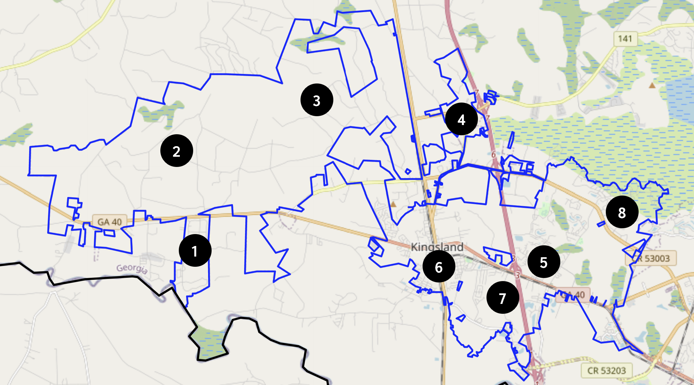

```{r setup, include=FALSE}
knitr::opts_chunk$set(echo = FALSE, message = FALSE, warning = FALSE)
```

```{r load libraries, include=FALSE}
library(tidyverse)
library(scales)
library(readxl)
library(ggthemes)
library(gt)
library(gtExtras)
library(bookdown)
library(kableExtra)
```

```{r load and clean data, include=FALSE}
colnames <- as.character(read_excel('data/qualtrics-data.xlsx', 
                                    na = '',
                                    n_max = 1, 
                                    col_names = FALSE)) # creates data frame of column names

qualtrics_data <- read_excel('data/qualtrics-data.xlsx', 
                             skip = 2, # skips variable names and questions
                             col_names = colnames) |> # merges imported data `colnames`
  filter(Status == 'IP Address') # filter out SPAM and Survey Preview

# restructure data
# age and residents need to be converted to numeric
qualtrics_data <- qualtrics_data |> 
  mutate(age = case_when(
    grepl('[^0-9]', age) ~ 'NA', # [^0-9] means 'any character except the digits 0 - 9
    TRUE ~ age
  )) |> 
  mutate(age = as.numeric(age),
         residents = as.numeric(residents))
```


# Executive Summary

Steven Sainz, Camden Connection’s CEO, submitted a draft plan of action to Darrell Moore at the Center for South Georgia Regional Impact regarding a needs assessment survey in October 2021. Darrell reached out to us and requested our assistance in conducting the survey soon thereafter. We were later asked on April 18, 2022 to include survey questions that would be used to support their application for a Community Development Block Grant (CDBG) from Georgia Department of Community Affairs (DCA). The anonymous survey was approved by Valdosta State University’s Institutional Review Board (IRB) in June 2022 and responses were gathered from June 27, 2022 through December 17, 2022. The survey received 722 responses, with 232 responses from the CDBG target area. This report outlines our survey methodology and the resulting analysis.

# Survey Methodology

We followed DCA's "Guide to Acceptable Methodology and Sample Survey Form^[<https://www.dca.ga.gov/sites/default/files/guide_to_acceptable_survey_methodology_0.pdf>] to conduct the LMI study. This study utilized a Qualtrics survey designed for an ARPA needs assessment, embedding specific questions to ascertain household size and household income .  Specifically, respondents were asked how many residents lived in the house and a follow up question was asked whereby the respondent would answer if the household income was over or under a specified threshold. This is consistent with the methodology guide mentioned above (see pages 3-4 for DCA’s suggested procedures). The study used the income limits provided by the U.S. Department of HUD for Camden County, Georgia (see page 6).^[<https://www.dca.ga.gov/sites/default/files/2021_income_limits.pdf>] The LMI thresholds for Camden County are in Table 1.^[The “LOW INCOME” row contained in the income limits file represents the 80% average median income (AMI) level for Camden County, which is the threshold for those households labeled as “moderate-income.”]


```{r lmi_df, include=FALSE}

# Residents <- c('1', '2', '3', '4', '5', '6', '7', '8')
# Threshold <- c('$37,050', '$42,350', '$47,650', '$52,900',
#                      '$57,150', '$61,400', '$65,600', '$69,850')

# lmi_table <- data.frame(Residents, Threshold)

lmi_df <- data.frame(household = c('1', '2', '3', '4', 
                                             '5', '6', '7', '8+'),
                        threshold = c('$37,050', '$42,350', '$47,650', '$52,900', 
                                            '$57,150', '$61,400', '$65,600', '$69,850'),
                        check.names = FALSE)

# lmi_table <- lmi_df |> 
#   gt() |> 
#   tab_header('Table 1: Income Limits') |> 
#   cols_label(household = 'No. of Residents',
#              threshold = 'LMI Threshold') |> 
#   cols_align(align = 'center',
#              columns = c(household,threshold))


```


```{r limits}
knitr::kable(lmi_df, caption = 'LMI Threshold by Household Size',
             col.names = c('Household Size',
                           'Threshold'),
             align = 'c',
             longtable=T)
```


## Selecting the Survey Method

The survey was accessed via a QR code that directed respondents to a Qualtrics-administered survey. These QR codes were available on widely distributed flyers in Kingsland and were mailed to residents in their utility bills. 

## Developing a Questionnare

We developed the survey using input from stakeholders in Camden County, primarily Steven Sainz. The survey questions were embedded into a broader, anonymous ARPA needs assessment survey. Therefore, we did not collect personally identifying information for the study. Further, given the method of collection, multiple responses could have been provided from any given household.

## Selecting the Sample

The universe for the study was residents in Kingsland, Georgia. The sample from the broader survey was pulled from respondents living in map areas six or seven (see Figure 2). 

```{r survey, out.width = '75%', fig.align='center',fig.cap='Survey Map Insert'}

```

Map areas six and seven were selected based on the affected area for Camden Counties proposed CDBG-DR-Infrastructure project  (see Figure  2). 

```{r census, out.width = '75%', fig.align='center',fig.cap = 'Census Tract in Proposed CDBG-DR-Infrastructure Project Area'}
knitr::include_graphics('images/kingsland-service-area.PNG')
```

There are approximately 2,796 households in areas six and seven (see block contained in Figure 2. Thus, the required sample size for the CDBG per Table 2 (page 6) in DCA's acceptable survey methodology instructions is 400 respondents. Unfortunately, the survey conducted only received 215 responses. 

## Conducting the Survey

As noted above, the survey was widely publicized in Kingsland and distributed through mail inserts . 

## Determining the Results

The results have been analyzed and parts A and B of the low- and moderate-income sheet are provided below.

## Documenting Your Effort

Documentation can be found on Github.^[<https://github.com/keitheleejr/cc-arpa-cdbg-study>] The raw data is stored as an MS Excel file titled "qualtrics-data.xlsx".^[<https://github.com/keitheleejr/cc-arpa-cdbg-study/blob/main/qualtrics-data.xlsx>] We used R for the data analysis. The .rmd file is titled "dca-cdbg-analysis.Rmd."^[<https://github.com/keitheleejr/cc-arpa-cdbg-study/blob/main/dca-cdbg-analysis.Rmd>] 
```{r, lmi_survey_area}
dca_cbdg_data <- qualtrics_data |> 
  mutate(lmi = coalesce(gfi1,gfi2,gfi3,gfi4,gfi5,gfi6,gfi7,gfi8)) |> 
  mutate(lmi_logical = case_when(
    grepl('Greater', lmi) ~ 'No', 
    grepl('Less Than',lmi) ~ 'Yes' ))


# lmi_household <- as.data.frame(table(dca_cbdg_data$lmi_logical)) |> 
#   mutate(Percentage = round(Freq/sum(Freq)*100,2)) |> 
#   arrange(desc(Percentage))
# 
# lmi_household_table <- lmi_household |> 
#   gt() |> 
#   cols_label(Var1 = 'Response',
#              Freq = 'Count') |> 
#   cols_align(
#     align = 'left',
#     columns = Var1
#   )
# 
# lmi_household_table
```


```{r, lmi_area_six}
target_area <- dca_cbdg_data |> 
  filter(grepl('[6-7]',mapnumber),
         ) 

# area_six_lmi_household <- as.data.frame(table(target_area$lmi_logical)) |> 
#   mutate(Percentage = round(Freq/sum(Freq)*100,2)) |> 
#   arrange(desc(Percentage))
# 
# area_six_lmi_household_table <- area_six_lmi_household |> 
#   gt() |> 
#   cols_label(Var1 = 'Response',
#              Freq = 'Count') |> 
#   cols_align(
#     align = 'left',
#     columns = Var1
#   )
# 
# area_six_lmi_household_table
```


# Low- and moderate-income worksheet

```{r question answers, include = FALSE}

line_1 <- 2796

line_2 <- target_area |> filter(!is.na(lmi_logical)) |> count()

line_3 <- target_area |> filter(lmi_logical == 'Yes') |> count()

line_4 <- target_area |> filter(lmi_logical == 'Yes', !is.na(residents)) |> summarize(sum(residents))

line_5 <- target_area |> filter(lmi_logical == 'No') |> count()

line_6 <- target_area |> filter(lmi_logical == 'No', !is.na(residents)) |> summarize(sum(residents))

line_7 <- line_4/line_3

line_8 <- line_6/line_5

line_9 <- line_3/line_2

line_10 <- line_5/line_2

line_11 <- line_1*round(line_9,2)

line_12 <- line_1*round(line_10,2)

line_13 <- round(line_7,2)*round(line_11,0)

line_14 <- round(line_8,2)*round(line_12,0)

line_15 <- round(line_13,0)+round(line_14,0)

line_16 <- round(line_13,0)/round(line_15,0)
```


## Part A. Information Contained in Your Survey

1. Enter the estimated total number of families in the target area.  
**`r line_1`**


2. Enter the total number of families interviewed.  
**`r round(line_2,2)`**  

3. Enter the total number of low- and moderate- income families interviewed.  
**`r round(line_3,2)`**  

4. Enter the total number of persons living in the low- and moderate-income families interviewed.  
**`r round(line_4,2)`**  

5. Enter the total number of non-low- and moderate-income families interviewed.  
**`r round(line_5,2)`**  

6. Enter the total number of persons living in the non-low- and moderate-income families.  
**`r round(line_6,2)`**  

\newpage

## Part B. Calculations Based on Data Contained in Your Survey

7. Divide Line 4 by Line 3. (This is the average size of the low-mod family you interviewed)   
**`r round(line_7,2)`**  


8. Divide Line 6 by Line 5. (This is the average size of non-low-mod family you interviewed)  
**`r round(line_8,2)`**  


9. Divide Line 3 by Line 2. (This is the proportion of families interviewed that have low and moderate incomes)  
**`r round(line_9,2)`**  

10. Divide Line 5 by Line 2. (This is the proportion of families interviewed that do not have low and moderate incomes)  
**`r round(line_10,2)`**  

11. Multiply Line 1 by Line 9. (This is the estimate of the total number of low-mod families in your target area)  
**`r round(line_11)`**  


12. Multiply Line 1 by Line 10. (This is the estimate of the total number of non-low-mod families in your target area.)  
**`r round(line_12,0)`**  

13. Multiply Line 7 by Line 11. (This is the estimate of the total number of low-mod persons in your target area.)  
**`r round(line_13,0)`**  

14. Multiply Line 8 by Line 12. (This is the estimate of the total number non-low-mod persons in your target area.)  
**`r round(line_14,0)`**  

15. Add Line 13 and Line 14. (This is the estimate of the total number of persons in your target area)   
**`r round(line_15,0)`**  

16. Divide Line 13 by Line 15, and multiply the resulting decimal by 100. (This is the estimated percentage of persons in your target area who have low and moderate Incomes.)  
**`r round(line_16*100,2)`**  

\newpage

# ARPA Needs Assessment Results

```{r load data, include=FALSE}
colnames <- as.character(read_excel("data/qualtrics-data.xlsx", 
                                    na = "",
                                    n_max = 1, 
                                    col_names = FALSE)) # creates data frame of column names

qualtrics_data <- read_excel("data/qualtrics-data.xlsx", 
                             skip = 2, # skips variable names and questions
                             col_names = colnames) %>% # merges imported data `colnames`
  filter(Status == "IP Address") # filter out SPAM and Survey Preview
```


```{r data cleaning}
qualtrics_data <- qualtrics_data %>% 
  mutate(age = case_when(
    grepl("[^0-9]", age) ~ "NA", # [^0-9] means "any character except the digits 0 - 9
    TRUE ~ age
  )) %>% 
  mutate(age = as.numeric(age))


```


```{r age, include=FALSE}


qualtrics_data %>% 
  filter(age > 0) %>% 
  summarize(mean_age = mean(age),
            median_age = median(age),
            range_age = range(age),
            sd_age = sd(age),
            n())
```


## Which option best describes your current housing situation?

```{r housing}
housing <- as.data.frame(table(qualtrics_data$housing)) %>% # create data frame
  mutate(Percentage = round(Freq/sum(Freq)*100,2)) %>%  # create new column with proportions
  arrange(desc(Percentage)) 

housing_table <- housing %>% 
  gt() %>% 
  cols_label(Var1 = "Response",
             Freq = "Count") %>% 
  cols_align(
    align = "left",
    columns = Var1
  ) # add additional cols_align if need to align additional columns

housing_table
```

## How many people live in your home?

```{r residents}


residents <- as.data.frame(table(qualtrics_data$residents)) %>% 
  mutate(Percentage = round(Freq/sum(Freq)*100,2)) 

residents_table <- residents %>% 
  gt() %>% 
  cols_label(Var1 = "Response",
             Freq = "Count") %>% 
  cols_align(
    align = "left",
    columns = Var1
  )

residents_table

```


## Are there any individuals living in your household who are younger than 18 years old?

```{r under18}
under18 <- as.data.frame(table(qualtrics_data$under18)) %>% 
  mutate(Percentage = round(Freq/sum(Freq)*100,2)) %>% 
  arrange(desc(Percentage))

under18_table <- under18 %>% 
  gt() %>% 
  cols_label(Var1 = "Response",
             Freq = "Count") %>% 
  cols_align(
    align = "left",
    columns = Var1
  )

under18_table
```


## If yes, how many?

```{r under18count}
qualtrics_data$under18count <- recode(qualtrics_data$under18count,
                                      One = "1")

under18count <- as.data.frame(table(qualtrics_data$under18count)) %>% 
  mutate(Percentage = round(Freq/sum(Freq)*100,2)) 

under18count_table <- under18count %>% 
  gt() %>% 
  cols_label(Var1 = "Response",
             Freq = "Count") %>% 
  cols_align(
    align = "left",
    columns = Var1
  )

under18count_table
```

## Do you live in a single-parent household?

```{r singleparent}

qualtrics_data$singleparent <- recode(qualtrics_data$singleparent,
                                      "yes" = "Yes",
                                      "no" = "No",
                                      "NO" = "No",
                                      "1" = "No",
                                      "Divorced" = "No",
                                      "Just me  childen are all married" = "No",
                                      "My son moved in after , I lost my husband to covid." = "No",
                                      "N/a" = "No",
                                      "N/A" = "No",
                                      "Na" = "No",
                                      "NA" = "No",
                                      "O" = "No",
                                      "Widow" = "No") 


singleparent <- as.data.frame(table(qualtrics_data$singleparent)) %>% 
  mutate(Percentage = round(Freq/sum(Freq)*100,2)) %>% 
  arrange(desc(Percentage))

singleparent_table <- singleparent %>% 
  gt() %>% 
  cols_label(Var1 = "Response",
             Freq = "Count") %>% 
  cols_align(
    align = "left",
    columns = Var1
  )

singleparent_table
```


## Are there any individuals living in your household who are older than 65 years old?

```{r over 65}

over65 <- as.data.frame(table(qualtrics_data$over65)) %>% 
  mutate(Percentage = round(Freq/sum(Freq)*100,2)) %>% 
  arrange(desc(Percentage))

over65_table <- over65 %>% 
  gt() %>% 
  cols_label(Var1 = "Response",
             Freq = "Count") %>% 
  cols_align(
    align = "left",
    columns = Var1
  )

over65_table
```

## Was the employment of anyone in your household affected by the COVID pandemic?

```{r employaffected}

employaffected <- as.data.frame(table(qualtrics_data$employaffected)) %>% 
  mutate(Percentage = round(Freq/sum(Freq)*100,2)) %>% 
  arrange(desc(Percentage))

employaffected_table <- employaffected %>% 
  gt() %>% 
  cols_label(Var1 = "Response",
             Freq = "Count") %>% 
  cols_align(
    align = "left",
    columns = Var1
  )

employaffected_table
```


## Did someone in the household experience a temporary reduction in hours worked?

```{r tempreducthours}

tempreducthours <- as.data.frame(table(qualtrics_data$tempreducthours)) %>% 
  mutate(Percentage = round(Freq/sum(Freq)*100,2)) %>% 
  arrange(desc(Percentage))

tempreducthours_table <- tempreducthours %>% 
  gt() %>% 
  cols_label(Var1 = "Response",
             Freq = "Count") %>% 
  cols_align(
    align = "left",
    columns = Var1
  )

tempreducthours_table
```


## Did someone in the household experience a permanent reduction in hours worked?

```{r permreducthours}

permreducthours <- as.data.frame(table(qualtrics_data$permreducthours)) %>% 
  mutate(Percentage = round(Freq/sum(Freq)*100,2)) %>% 
  arrange(desc(Percentage))

permreducthours_table <- permreducthours %>% 
  gt() %>% 
  cols_label(Var1 = "Response",
             Freq = "Count") %>% 
  cols_align(
    align = "left",
    columns = Var1
  )

permreducthours_table
```

\newpage

## Did someone in the household become temporarily out of work?

```{r tempoow}

tempoow <- as.data.frame(table(qualtrics_data$tempoow)) %>% 
  mutate(Percentage = round(Freq/sum(Freq)*100,2)) %>% 
  arrange(desc(Percentage))

tempoow_table <- tempoow %>% 
  gt() %>% 
  cols_label(Var1 = "Response",
             Freq = "Count") %>% 
  cols_align(
    align = "left",
    columns = Var1
  )

tempoow_table
```


## Did someone in the household become permanently out of work?

```{r permoow}

permoow <- as.data.frame(table(qualtrics_data$permoow)) %>% 
  mutate(Percentage = round(Freq/sum(Freq)*100,2)) %>% 
  arrange(desc(Percentage))

permoow_table <- permoow %>% 
  gt() %>% 
  cols_label(Var1 = "Response",
             Freq = "Count") %>% 
  cols_align(
    align = "left",
    columns = Var1
  )

permoow_table
```

## If you are still working, are you able to work remotely?

```{r workremote}

workremote <- as.data.frame(table(qualtrics_data$workremote)) %>% 
  mutate(Percentage = round(Freq/sum(Freq)*100,2)) %>% 
  arrange(desc(Percentage))

workremote_table <- workremote %>% 
  gt() %>% 
  cols_label(Var1 = "Response",
             Freq = "Count") %>% 
  cols_align(
    align = "left",
    columns = Var1
  )

workremote_table
```


## How did you find work during COVID?


```{r howfoundwork}

howfoundwork <- as.data.frame(table(qualtrics_data$howfoundwork)) %>% 
  mutate(Percentage = round(Freq/sum(Freq)*100,2)) %>% 
  arrange(desc(Percentage))

howfoundwork_table <- howfoundwork %>% 
  gt() %>% 
  cols_label(Var1 = "Response",
             Freq = "Count") %>% 
  cols_align(
    align = "left",
    columns = Var1
  )

howfoundwork_table
```


## Do you require child care?

```{r childcare}

childcare <- as.data.frame(table(qualtrics_data$childcare)) %>% 
  mutate(Percentage = round(Freq/sum(Freq)*100,2)) %>% 
  arrange(desc(Percentage))

childcare_table <- childcare %>% 
  gt() %>% 
  cols_label(Var1 = "Response",
             Freq = "Count") %>% 
  cols_align(
    align = "left",
    columns = Var1
  )

childcare_table
```


## Since March 2020, did you access any services or resources from a nonprofit or community organization (for example, church, shelter, food pantry, etc.)?

```{r services}

services <- as.data.frame(table(qualtrics_data$services)) %>% 
  mutate(Percentage = round(Freq/sum(Freq)*100,2)) %>% 
  arrange(desc(Percentage))

services_table <- services %>% 
  gt() %>% 
  cols_label(Var1 = "Response",
             Freq = "Count") %>% 
  cols_align(
    align = "left",
    columns = Var1
  )

services_table
```


## If yes, was this the first time you needed resources from nonprofit or community organizations?

```{r servicesfirsttime}

servicesfirsttime <- as.data.frame(table(qualtrics_data$servicesfirsttime)) %>% 
  mutate(Percentage = round(Freq/sum(Freq)*100,2)) %>% 
  arrange(desc(Percentage))

servicesfirsttime_table <- servicesfirsttime %>% 
  gt() %>% 
  cols_label(Var1 = "Response",
             Freq = "Count") %>% 
  cols_align(
    align = "left",
    columns = Var1
  )

servicesfirsttime_table
```


## Do you have access to the COVID vaccine and/or booster?

```{r covidvaccineavail}


covidvaccineavail <- as.data.frame(table(qualtrics_data$covidvaccineavail)) %>% 
  mutate(Percentage = round(Freq/sum(Freq)*100,2)) %>% 
  arrange(desc(Percentage))

covidvaccineavail_table <- covidvaccineavail %>% 
  gt() %>% 
  cols_label(Var1 = "Response",
             Freq = "Count") %>% 
  cols_align(
    align = "left",
    columns = Var1
  )

covidvaccineavail_table
```


## Do you have internet access?

```{r internetaccess}

internetaccess <- as.data.frame(table(qualtrics_data$internetaccess)) %>% 
  mutate(Percentage = round(Freq/sum(Freq)*100,2)) %>% 
  arrange(desc(Percentage))

internetaccess_table <- internetaccess %>% 
  gt() %>% 
  cols_label(Var1 = "Response",
             Freq = "Count") %>% 
  cols_align(
    align = "left",
    columns = Var1
  )

internetaccess_table
```


## Do you have access to an internet-connected device in your home (for example, computer/laptop, smartphone, or tablet)?

```{r internetaccesshome}

internetaccesshome <- as.data.frame(table(qualtrics_data$internetaccesshome)) %>% 
  mutate(Percentage = round(Freq/sum(Freq)*100,2)) %>% 
  arrange(desc(Percentage))

internetaccesshome_table <- internetaccesshome %>% 
  gt() %>% 
  cols_label(Var1 = "Response",
             Freq = "Count") %>% 
  cols_align(
    align = "left",
    columns = Var1
  )

internetaccesshome_table
```


## There is ________ food in my home to satisfy the needs of those in the household

```{r foodsecurity}

qualtrics_data$foodsecurity <- recode(qualtrics_data$foodsecurity,
                                      "There is always enough food in my home to satisfy the needs of those in the household" = "Always Enough",
                                      "There is mostly enough food in my home to satisfy the needs of those in the household" = "Mostly Enough",
                                      "There is never enough food in my home to satisfy the needs of those in the household" = "Never Enough",
                                      "There is rarely enough food in my home to satisfy the needs of those in the household" = "Rarely Enough")

foodsecurity <- as.data.frame(table(qualtrics_data$foodsecurity)) %>% 
  mutate(Percentage = round(Freq/sum(Freq)*100,2)) %>% 
  arrange(desc(Percentage))

foodsecurity_table <- foodsecurity %>% 
  gt() %>% 
  cols_label(Var1 = "Response",
             Freq = "Count") %>% 
  cols_align(
    align = "left",
    columns = Var1
  )

foodsecurity_table
```


## If there was an emergency today and you needed $400, how would you handle the situation?

```{r fourhundred}

fourhundred <- as.data.frame(table(qualtrics_data$fourhundred)) %>% 
  mutate(Percentage = round(Freq/sum(Freq)*100,2)) %>% 
  arrange(desc(Percentage))

fourhundred_table <- fourhundred %>% 
  gt() %>% 
  cols_label(Var1 = "Response",
             Freq = "Count") %>% 
  cols_align(
    align = "left",
    columns = Var1
  )

fourhundred_table
```

