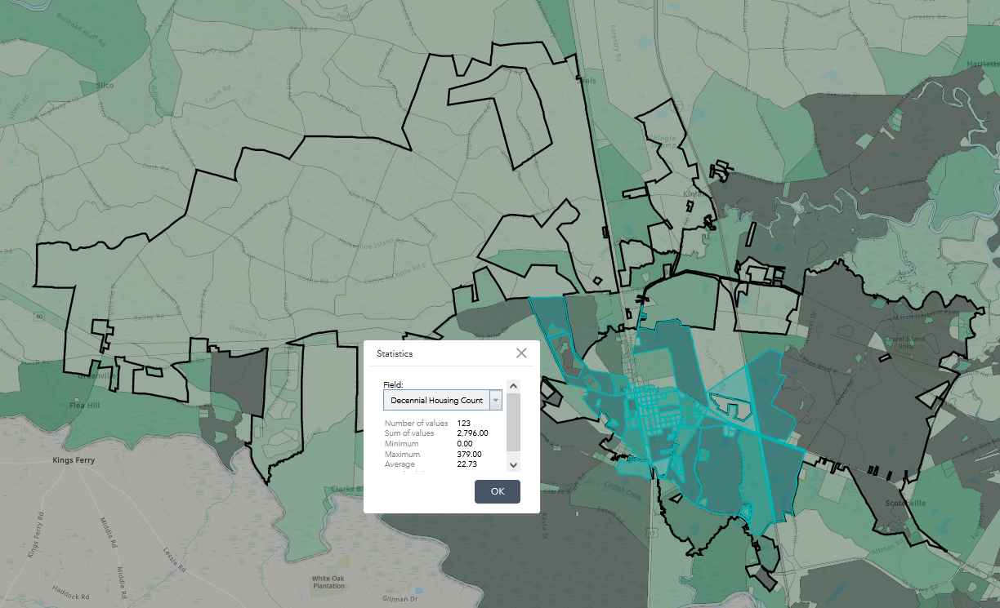
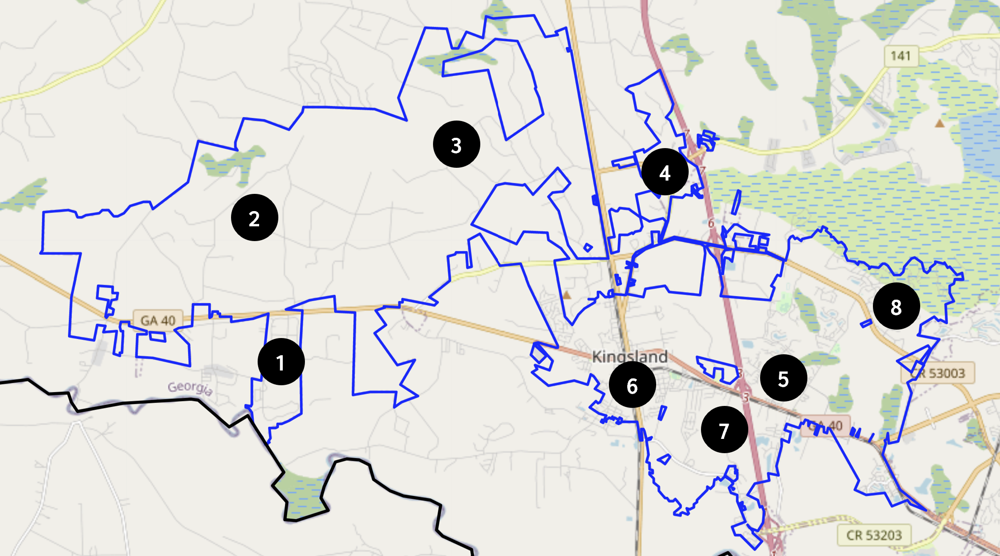

```{r setup, include=FALSE}
knitr::opts_chunk$set(echo = FALSE, message = FALSE, warning = FALSE)
```

```{r load libraries, include=FALSE}
library(tidyverse)
library(scales)
library(readxl)
library(ggthemes)
library(gt)
library(gtExtras)
```

```{r load and clean data, include=FALSE}
colnames <- as.character(read_excel("qualtrics-data.xlsx", 
                                    na = "",
                                    n_max = 1, 
                                    col_names = FALSE)) # creates data frame of column names

qualtrics_data <- read_excel("qualtrics-data.xlsx", 
                             skip = 2, # skips variable names and questions
                             col_names = colnames) %>% # merges imported data `colnames`
  filter(Status == "IP Address") # filter out SPAM and Survey Preview

# restructure data
# age and residents need to be converted to numeric
qualtrics_data <- qualtrics_data %>% 
  mutate(age = case_when(
    grepl("[^0-9]", age) ~ "NA", # [^0-9] means "any character except the digits 0 - 9
    TRUE ~ age
  )) %>% 
  mutate(age = as.numeric(age),
         residents = as.numeric(residents))
```


# Survey Methodology

To be added by Keith over the weekend. 


```{r, lmi_survey_area}
dca_cbdg_data <- qualtrics_data %>% 
  mutate(lmi = coalesce(gfi1,gfi2,gfi3,gfi4,gfi5,gfi6,gfi7,gfi8)) %>% 
  mutate(lmi_logical = case_when(
    grepl("Greater", lmi) ~ "No", 
    grepl("Less Than",lmi) ~ "Yes" ))


# lmi_household <- as.data.frame(table(dca_cbdg_data$lmi_logical)) %>% 
#   mutate(Percentage = round(Freq/sum(Freq)*100,2)) %>% 
#   arrange(desc(Percentage))
# 
# lmi_household_table <- lmi_household %>% 
#   gt() %>% 
#   cols_label(Var1 = "Response",
#              Freq = "Count") %>% 
#   cols_align(
#     align = "left",
#     columns = Var1
#   )
# 
# lmi_household_table
```


```{r, lmi_area_six}
target_area <- dca_cbdg_data %>% 
  filter(grepl("[6-7]",mapnumber),
         ) 

# area_six_lmi_household <- as.data.frame(table(target_area$lmi_logical)) %>% 
#   mutate(Percentage = round(Freq/sum(Freq)*100,2)) %>% 
#   arrange(desc(Percentage))
# 
# area_six_lmi_household_table <- area_six_lmi_household %>% 
#   gt() %>% 
#   cols_label(Var1 = "Response",
#              Freq = "Count") %>% 
#   cols_align(
#     align = "left",
#     columns = Var1
#   )
# 
# area_six_lmi_household_table
```

# Low- and moderate-income worksheet

```{r question answers, include = FALSE}

line_1 <- 2796

line_2 <- target_area %>% filter(!is.na(lmi_logical)) %>% count()

line_3 <- target_area %>% filter(lmi_logical == "Yes") %>% count()

line_4 <- target_area %>% filter(lmi_logical == "Yes", !is.na(residents)) %>% summarize(sum(residents))

line_5 <- target_area %>% filter(lmi_logical == "No") %>% count()

line_6 <- target_area %>% filter(lmi_logical == "No", !is.na(residents)) %>% summarize(sum(residents))

line_7 <- line_4/line_3

line_8 <- line_6/line_5

line_9 <- line_3/line_2

line_10 <- line_5/line_2

line_11 <- line_1*line_9

line_12 <- line_1*line_10

line_13 <- line_7*line_11

line_14 <- line_8*line_12

line_15 <- line_13+line_14

line_16 <- line_13/line_15
```


## Part A. Information Contained in Your Survey

1. Enter the estimated total number of families in the target area.  
**`r line_1`**


2. Enter the total number of families interviewed.  
**`r round(line_2,2)`**  

3. Enter the total number of low- and moderate- income families interviewed.  
**`r round(line_3,2)`**  

4. Enter the total number of persons living in the low- and moderate-income families interviewed.  
**`r round(line_4,2)`**  

5. Enter the total number of non-low- and moderate-income families interviewed.  
**`r round(line_5,2)`**  

6. Enter the total number of persons living in the non-low- and moderate-income families.  
**`r round(line_6,2)`**  

## Part B. Calculations Based on Data Contained in Your Survey

7. Divide Line 4 by Line 3. (This is the average size of the low-mod family you interviewed)   
**`r round(line_7,2)`**  


8. Divide Line 6 by Line 5. (This is the average size of non-low-mod family you interviewed)  
**`r round(line_8,2)`**  


9. Divide Line 3 by Line 2. (This is the proportion of families interviewed that have low and moderate incomes)  
**`r round(line_9,2)`**  

10. Divide Line 5 by Line 2. (This is the proportion of families interviewed that do not have low and moderate incomes)  
**`r round(line_10,2)`**  

11. Multiply Line 1 by Line 9. (This is the estimate of the total number of low-mod families in your target area)  
**`r round(line_11,2)`**  


12. Multiply Line 1 by Line 10. (This is the estimate of the total number of non-low-mod families in your target area.)  
**`r round(line_12,0)`**  

13. Multiply Line 7 by Line 11. (This is the estimate of the total number of low-mod persons in your target area.)  
**`r round(line_13,0)`**  

14. Multiply Line 8 by Line 12. (This is the estimate of the total number non-low-mod persons in your target area.)  
**`r round(line_14,0)`**  

15. Add Line 13 and Line 14. (This is the estimate of the total number of persons in your target area)   
**`r round(line_15,0)`**  

16. Divide Line 13 by Line 15, and multiply the resulting decimal by 100. (This is the estimated percentage of persons in your target area who have low and moderate Incomes.)  
**`r round(line_16*100,2)`**  

\newpage

### Figure 1: Census Tract Reference for Service Area Household Estimate

```{r, out.width = "75%", fig.align="center"}

```

### Figure 2: Service Area Survey Question

```{r, out.width = "75%", fig.align="center"}

```

